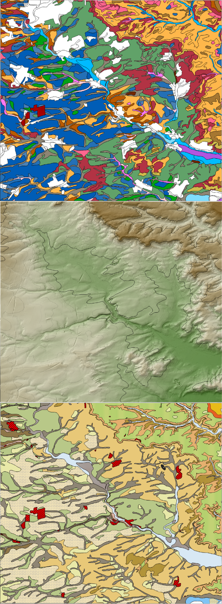

```{r script_intro, echo=FALSE}
library(knitr)
library(rmarkdown)
library(tufte)
```

# Preface {.unnumbered}

This is an introduction course to R language applied for Physical Geographical science in **GEO77** teaching.

This course will help you with the basis of R language and first uses of Machine Learning.



**General info:**

-   Name and email: Mathias Bellat Ph.D candidate, SFB1070 ResourcesCultures, Working group geomorphology and soil sciences. Email : [mathias.bellat\@uni-tuebingen.de](mailto:mathias.bellat@uni-tuebingen.de){.email} and [nicolas-andres.riveras-munoz\@uni-tuebingen.de](mailto:nicolas-andres.riveras-munoz@uni-tuebingen.de){.email}
-   Dates: 22/11, 29/11, 6/12 and 13/12
-   Language: English, German (only for specific questions).
-   Resources: In the "Reference chapter" and on the ILLAS webpage [GEO77](https://ovidius.uni-tuebingen.de/ilias3/goto.php?target=crs_3872795&client_id=pr02) with the password "**SoilScience**".

**Objectives:**

-   Get basic of R language under *RStudio*, different type of features, writing an algorithms, importing and exporting data.
-   Realizing basic Machine Learning operation (Decision tree, CART...).
-   Produce maps after geotreatments for specifics cases ( digital soil mapping... ).
